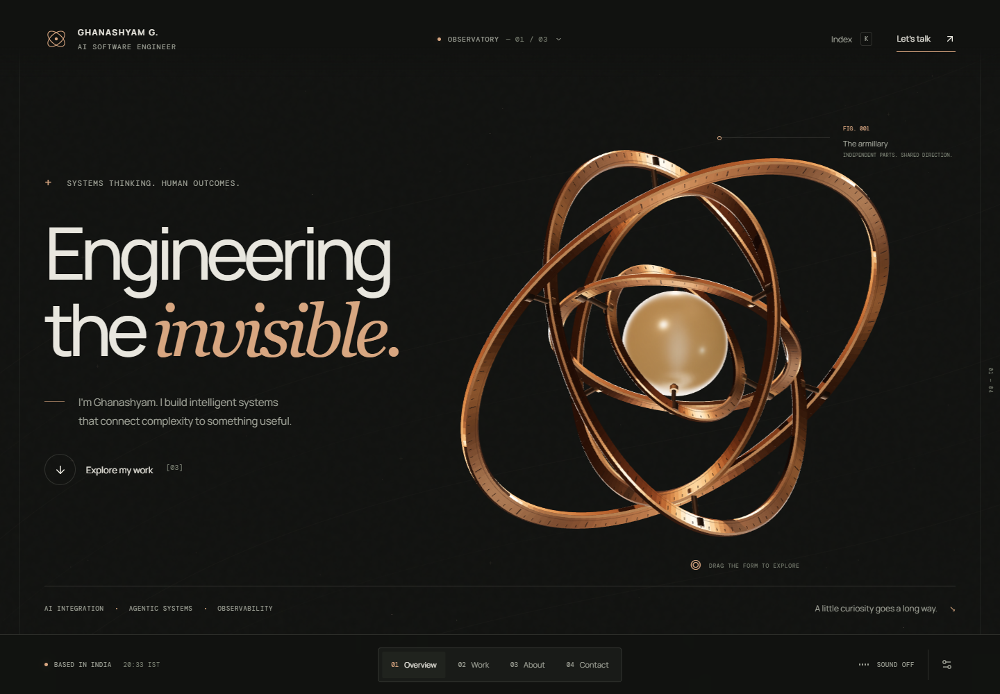

# Ghanashyam — The Observatory

A complete, runnable portfolio prototype for an AI software engineer. A kinetic armillary, an editorial interface, and interactive systems make the engineering itself part of the experience.

The owner's brief and corrections are recorded in [PORTFOLIO-REQUIREMENTS.md](docs/PORTFOLIO-REQUIREMENTS.md).

[Watch the short-laptop reveal and continuous data-flow recording](docs/motion/product-loop-laptop.webm). It uses ordinary wheel input, then holds the scroll position while soft glows keep looping.



## Run locally

Requires Node.js 24.x, matching the pinned Vercel runtime.

```powershell
git clone https://github.com/gshyam46/ghanashyam.git
cd ghanashyam
npm.cmd ci
npm.cmd run dev
```

Open **http://127.0.0.1:3000**. On macOS/Linux, use `npm` instead of `npm.cmd`. Local viewing needs no environment setup or database. The optional note sender uses the owner's existing public EmailJS configuration in `data/contact-config.ts`; its live inbox delivery has not been tested.

Direct material links: `/?theme=copper`, `/?theme=ink`, and `/?theme=silver`.

## Explore the prototype

- **Turn the armillary.** Five machined copper rings nest around a softly glowing ceramic core. A warm light travels through the form as the rings turn slowly about different axes; scrolling aligns the sculpture with each chapter. Drag to rotate it and release for a gentle inertial settle. A precise desktop dot and softly following cursor ring adapt to controls and dragging; text inputs and touch/reduced-motion use native behavior. Focus the sculpture and use arrow keys; press **R** to reset.
- **Scroll naturally** through the four chapters, use the bottom navigation, or press **K** for the index.
- **Inspect selected systems.** Relay has explorable workflow stages. The LLM observability model has selectable trace spans and a context budget slider. AIDA changes prepared SQL and sample results when you select a question.
- **Look closer at the experience.** The career record runs chronologically from ContentEaseAI to Oracle, with concise year labels. Open any entry for contributions, technologies, location, and previous/next navigation. Selected engineering, applied-AI, and observability skills sit beside the practice notes.
- **Look behind the interface.** A compact application window with navigation, tabs, and an elongated diamond introduces the product. The same window shrinks and moves into the Interface component while the engineering opens beneath it: a 15-component architecture with soft, diffuse glows travelling along request/response and background-job paths. A brief hold after opening leads naturally into the career record. Hover, focus, or tap a symbol to inspect its role. Observability spans the system. This is a conceptual illustration, not a new project or a claim about a deployed stack.
- **Follow the atmosphere.** A quiet mathematical field responds to pointer proximity and chapter changes, with layered desktop parallax, quieter phone background depth, reversible section entrances/exits, and a slow left-to-right light along the project selector. A short glossy touch trail responds to phone taps and native swipes. Larger small text, more generous touch controls, and viewport-aware dropdowns retain the original visual language.
- **Compare three visual treatments.** Click the material name at the top or the settings icon at the bottom right: Observatory (copper), Field notes (graphite/paper), and After hours (silver). These are three treatments of one complete concept, rather than separate websites. The chosen material is saved locally.
- **Set the atmosphere.** The first version's slowly breathing D-major composition remains, manually enabled and initially off. The latest default is 30%, with interaction chimes 8% stronger than the prior default output. Fades and mute behavior remain; reload restores these defaults and hidden tabs suspend audio. All sound is generated locally.
- **A prepared entrance.** A brief branded loading screen waits for local fonts and the first rendered sculpture frame, or its SVG fallback. It fades as soon as those are ready, with Continue/Escape and a six-second maximum wait. It improves first paint without claiming every device will run at the same speed.
- **Write a note.** A small in-page composer accepts a topic, message, optional name, and reply email. Only **Send note** calls EmailJS. Failed submissions preserve the draft for retry; a direct `mailto:gshyam2603@gmail.com` link and professional profiles remain available. This is an email composer, not a live chat or chatbot.

**The working toolkit:** after the full Practice section and career history, two compact grey technology rows move left to right at a quicker pace. Scroll up to reverse, down to restore; hover to slow, or drag a row sideways. Open **Explore the toolkit** for the complete static list. Local and global Pause, reduced motion, hidden tabs, and offscreen suspension are supported.

**The energy band:** between Projects and Practice, bright intertwined filaments flow across a shallow horizontal field. Move the pointer to bend the strands, or tap/activate the pulse control to send energy through them. Motion follows the existing Pause and reduced-motion preferences.

## Content and scope

Content was checked against the supplied repository, the live portfolio, and the owner's public repositories. Relay and AIDA link to their real repositories. The latest observability/LLM optimization focus comes from the user's brief.

**All interactive project interfaces use clearly labelled illustrative data.** They explain the ideas; they do not call a live backend or claim measured project results. No fabricated client counts, testimonials, impact percentages, or awards are presented.

The owner confirmed `gshyam2603@gmail.com` and the employment dates. The timeline deliberately shows years only: **2023 → 2024–25 → 2025 → 2025–Present**. Exact confirmed month ranges remain in [CONTENT-SOURCES.md](docs/CONTENT-SOURCES.md).

The owner cancelled the résumé feature. There is no résumé button, browser viewer, or download action in this experience. The unrelated legacy template PDF was deleted; the owner's personal source document remains private in the ignored `resume/` folder. See [CONTACT-RESEARCH.md](docs/CONTACT-RESEARCH.md) for the original email integration and source resolution.

EmailJS uses the existing service/template route, whose recipient is configured in the owner's provider dashboard. The eight mocked contact browser tests passed; no real email was sent, and inbox delivery is not claimed. The draft stays in component memory and is lost if the page is refreshed.

## Build and verify

```powershell
npm.cmd run typecheck
npm.cmd run build
npm.cmd run start
```

Run browser verification with:

```powershell
npm.cmd run test:e2e:production
```

The production test command starts an isolated production server on port 3100 after `npm run build`. Use `npm run test:e2e` for development checks. On Windows they use installed Google Chrome. Set `PLAYWRIGHT_CHROMIUM_EXECUTABLE` to use a different browser executable. On other platforms, run `npx playwright install chromium` first. Tests cover desktop and mobile behavior, project and career interactions, styled dropdowns, dialogs, keyboard navigation, saved materials, audio controls, reduced motion, WebGL fallback, and automated accessibility checks.

`tests/contact.spec.ts` fully intercepts EmailJS requests and checks validation, the template payload, success, failure/retry, and duplicate prevention during a slow response. `tests/responsive.spec.ts` exercises eight viewport sizes: 320×568, 360×740, 390×844, 430×932, 768×1024, 844×390, 1024×768, and 1440×1000. It checks navigation bounds, artwork placement, career dialogs, and the note dropdown without sending a message.

The armillary production build and 14 applicable browser checks passed. See [VERIFICATION.md](docs/VERIFICATION.md) for current results and limits. Earlier screenshots and motion recordings remain historical.

## Structure

| File | Purpose |
| --- | --- |
| `app/page.tsx` | Page entry point |
| `app/layout.tsx` | Metadata and locally bundled fonts |
| `app/globals.css` | Responsive layout, materials, and motion |
| `app/refinements.css` | Readability, scroll reveals, touch layouts, and small-screen refinements |
| `components/observatory/Observatory.tsx` | Chapters, navigation, settings, and contact |
| `components/observatory/Sculpture.tsx` | Armillary rendering, pointer/keyboard interaction, chapter poses, and static SVG fallback |
| `components/observatory/armillary.ts` | Procedural nested rings, luminous ceramic core, materials, and travelling light |
| `components/observatory/Atmosphere.tsx` | Pointer-responsive mathematical field and parallax |
| `components/observatory/Cursor.tsx` | Precise desktop pointer with a softly following ring and native-input fallbacks |
| `components/observatory/SystemMap.tsx` | Annotated architectural layers revealed by ordinary scrolling |
| `components/observatory/ProjectDemo.tsx` | Interactive, illustrative project models |
| `components/observatory/project-demo.css` | Project model styling |
| `components/observatory/ExperienceDetails.tsx` | Career detail dialog and previous/next navigation |
| `components/observatory/Select.tsx` | Styled, keyboard-accessible dropdown with viewport placement |
| `components/observatory/ContactNote.tsx` | Explicit-send email composer with validation and retry |
| `data/portfolio.ts` | Editable identity, work, and experience content |
| `data/contact-config.ts` | Existing owner EmailJS service/template and public browser key |
| `lib/ambient.ts` | Opt-in Web Audio soundscape |
| `tests/*.spec.ts` | Experience, mocked contact, accessibility, and responsive browser checks |

The previous portfolio's unused components, constants, utilities, images, videos, template PDF, and retired tooling configuration have been removed: 59 files totaling 35.7 MiB. The repository contains the active Observatory source, current configuration, tests, and documentation. [REPOSITORY-CLEANUP.md](docs/REPOSITORY-CLEANUP.md) records the import audit, exact categories removed, and publishing exclusions. Next.js generates `AGENTS.md` and `CLAUDE.md` to document its current development conventions.

## Design and implementation

Next.js 16, React 19, TypeScript, Three.js, native CSS, and Web Audio. Manrope and DM Mono are bundled locally, so visitors do not need a font-service connection. Framework and graphics versions were refreshed from the supplied repository's original stack.

Motion respects `prefers-reduced-motion`. Artwork pauses when the page is hidden, uses a capped pixel ratio and a smaller mobile mesh, supports keyboard control, and falls back to SVG without WebGL. The atmospheric canvas redraws while interactions settle; the custom cursor and pointer parallax are disabled for coarse pointers and reduced motion. Phone scroll parallax is limited to the background field. Touch light fades within 460ms; the decorative loop stops offscreen and in hidden tabs. All additions respect Pause and reduced motion, and keyboard-focused content stays visible. Native dialogs provide focus containment, Escape dismissal, and focus restoration. Dropdowns support arrows, Home/End, type-ahead, Enter/Space, and Escape. There is no scroll interception or forced intro.

References and the rationale behind the three treatments are in [DESIGN.md](docs/DESIGN.md). The implementation and artwork are original; source sites informed the visual and interaction direction.

## Deployment

The production source is prepared for Vercel with Next.js detection, Node 24.x, reproducible installation, deployment exclusions, canonical metadata, a social preview image, robots, and a sitemap. See [LAUNCH.md](docs/LAUNCH.md) for exact project settings, Preview and Production commands, and post-launch checks.

Vercel builds use the project's production domain for canonical metadata. Set `NEXT_PUBLIC_SITE_URL` before building to override it; local builds fall back to `https://ghanashyamg.vercel.app`. The release targets [gshyam46/ghanashyam](https://github.com/gshyam46/ghanashyam), with Root Directory `./` on Vercel. GitHub and Vercel authentication are still required; no production deployment has been verified. Live EmailJS inbox delivery remains unverified.
